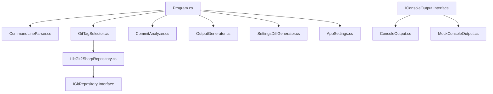

# Check Release Architecture Overview

This document provides an overview of the architecture and design patterns used in the Check Release application.

## System Architecture

Check Release follows an object-oriented architecture with clear separation of concerns. The application is structured around several key components, each with a specific responsibility:

### Key Components

1. **Program.cs**: Entry point and main workflow orchestration
   - Coordinates the overall flow of the application
   - Handles error handling and exit codes
   - Integrates all other components

2. **CommandLineParser.cs**: Command-line argument parsing and validation
   - Parses command-line arguments using System.CommandLine
   - Validates input and provides usage information
   - Converts arguments into a structured options object

3. **GitTagSelector.cs**: Git repository interaction and tag/commit selection
   - Implements different strategies for selecting tags or commits
   - Handles direct comparison, auto mode, stream mode, etc.
   - Works with the IGitRepository interface

4. **CommitAnalyzer.cs**: Commit message analysis and JIRA ticket extraction
   - Analyzes commit messages to extract JIRA tickets
   - Formats descriptions by replacing underscores with spaces
   - Filters commits based on criteria

5. **OutputGenerator.cs**: Output generation in plain text and HTML formats
   - Generates plain text or HTML output
   - Adds meta tags for Slack unfurling in HTML mode
   - Formats commit information for display

6. **SettingsDiffGenerator.cs**: JSON configuration comparison
   - Compares appsettings.json files between tags
   - Identifies added and removed properties
   - Formats the diff for display

7. **AppSettings.cs**: Configuration management
   - Loads settings from appsettings.json
   - Provides default values
   - Integrates with command-line options

## Design Patterns

### Command Pattern

The application implements the command pattern through its CLI interface, with different modes of operation based on the arguments provided:

- Direct comparison between two tags
- Automatic selection of recent tags
- Stream mode for comparing HEAD to a historical commit

### Strategy Pattern

Different strategies are used for tag selection and output generation based on the command-line arguments:

- GitTagSelector implements different strategies for selecting tags
- OutputGenerator uses different strategies for generating output formats

### Factory Pattern

The GitTagSelector class acts as a factory for creating collections of commits based on different selection criteria:

- Creates commit pairs based on tag selection mode
- Handles the creation of appropriate commit collections

### Builder Pattern

The OutputGenerator class uses a builder-like approach to construct the output in different formats:

- Builds HTML or plain text output
- Constructs meta tags for Slack unfurling
- Assembles the complete output with appropriate formatting

### Dependency Injection

The application uses constructor injection to provide dependencies:

- Components receive their dependencies through constructors
- Interfaces are used to abstract implementations
- This approach enhances testability

## Interface Abstractions

### IGitRepository

This interface abstracts Git operations, allowing for different implementations:

- LibGit2SharpRepository: Production implementation using LibGit2Sharp
- MockGitRepository: Test implementation for unit testing

### IConsoleOutput

This interface abstracts console output operations:

- ConsoleOutput: Production implementation using Console
- MockConsoleOutput: Test implementation for unit testing

## Cross-Cutting Concerns

### Error Handling

- Comprehensive try-catch blocks in Program.cs
- Detailed error messages with context
- Appropriate exit codes for different error conditions

### Logging

- Debug mode for verbose output
- Trace mode for even more detailed information
- Consistent logging through IConsoleOutput

### Configuration

- Flexible configuration system with clear priority order:
  1. Command-line arguments
  2. appsettings.json values
  3. Default values

## Testing Approach

The application is designed with testability in mind:

- Interfaces for external dependencies
- Mock implementations for testing
- Clear separation of concerns
- Unit tests for core components

## Key Technical Decisions

### C# and .NET 9

The application is implemented in C# using .NET 9, providing:

- Modern, type-safe development environment
- Cross-platform compatibility
- Rich ecosystem of libraries

### LibGit2Sharp

The application uses LibGit2Sharp for Git operations instead of shell commands:

- Type-safe interface to Git repositories
- Better error handling
- No dependency on external Git commands

### System.CommandLine

Command-line parsing is implemented using System.CommandLine:

- Clean, declarative way to define command-line interfaces
- Built-in help text generation
- Structured argument parsing

### System.Text.Json

JSON parsing and comparison for the settings diff feature uses System.Text.Json:

- Efficient and type-safe JSON handling
- Built-in to .NET, no external dependencies
- Good performance characteristics

### Cross-Platform Support

The application is designed to be cross-platform:

- Windows, Linux, and macOS support
- x64 and ARM64 architecture support
- Self-contained executables for easy distribution
